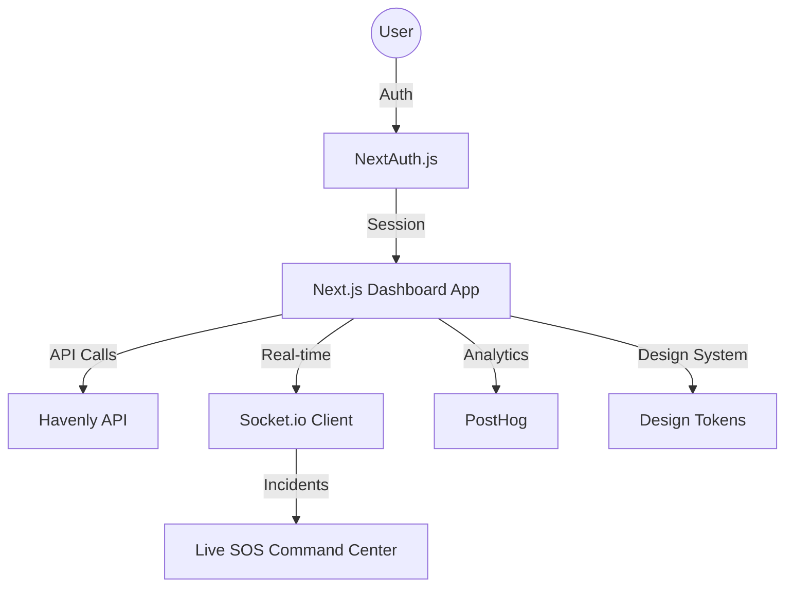

# Havenly Solutions - Dashboard

The command center for Havenly Solutions, providing multi-role access for founders, executives, managers, developers, partners, and investors.

## Architecture

## How it works

- **Portals**: Seven distinct portals tailored to specific roles, ensuring relevant data and tools are accessible to each user type.
- **RBAC**: Robust Role-Based Access Control managed via the DashboardShell and permissions layer.
- **Real-time Monitoring**: Integrated Mapbox and Socket.io for live tracking of safety incidents and SOS alerts.
- **Analytics**: Comprehensive business and technical metrics powered by PostHog and custom backend aggregations.
- **Design**: Built on a strict design system derived from Stitch tokens, supporting both light and dark modes.

## Where we left off

- Integrated the new generalized React Email layout for all transactional and marketing communications.
- Optimized backend Redis client usage to support high-concurrency dashboard sessions.
- Cleaned up the project by removing sensitive hardcoded keys and redundant test scripts.
- Standardized brand contact information (phone and logo) across the entire interface.

## Errors found and fixed

- **Secret Exposure**: Identified and removed plaintext API keys from the codebase, moving them to secure environment variables.
- **Stale References**: Removed dead links and documentation for features that have been superseded or removed.
- **Dependency Conflicts**: Resolved React versioning issues to ensure compatibility with the email rendering engine.

## Engineer Profile

The Havenly Solutions dashboard is engineered by a specialized team focused on building high-performance, secure, and intuitive interfaces for safety and civic technology. The architecture prioritizes data integrity and real-time responsiveness.

## Launch Roadmap

- Implement comprehensive end-to-end testing for all seven portal workflows.
- Finalize the integration of the token service for secure unsubscribe management.
- Complete the migration of all remaining legacy email templates to the new React system.
- Perform a final accessibility audit to ensure compliance with international standards.
